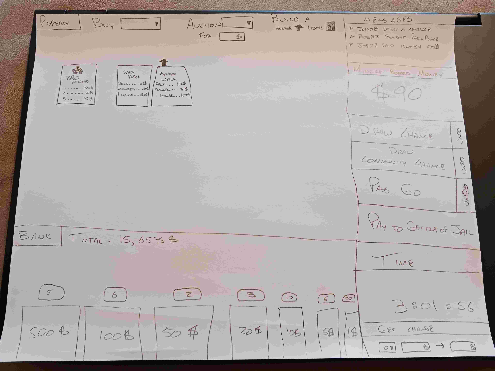

 - Here are my notes: [Notes](notes.md)

# Startup specifications:
## The Idea
I am going to create a **Monopoly Wallet** that will help people in playing the 
great game of Monopoly so each person is their own banker.

**The website will do the following things:**
 - Keep track of the money in your wallet
 - Keep track of the properties you own and the buildings you have on each
 - Keep track of the Chance and Community Chest piles and 
   perform their actions when you have to draw one of those cards
 - Allow you to pay _other people_ when you land on their properties
 - Allow you to pay _the bank_ when necessary
 - Keep track of the amount of money in the middle of the board
 - Allow you to trade properties with other players
 - Keep track of how long each game takes to play

## The Technologies
  Here is how I am going to use each of the technologies in the **Monopoly Wallet**
   1. **Authentication:** Each person will have to login to their account to play. They
      will also have to login to the game that they are going to play with their group.
   2. **Database data:** The database will keep track of several things at the end of each game.
      These things inlcude: the time it took to play the game, the amount of money the winner had,
      the order in which the winner accumulated properties. These things will be tracked for the _game_.
      The database will also track the number of wins for each individual player and the stats for each game
      they have won.
   3. **WebSocket Data:** This will be used to communicate between players who are in the same game.
      These communications will include:
   - When a player buys a property or a house or hotel for their properties
   - When players make a trade
   - When a player draws a Chance or Community Chest card
   - When a player pays to the middle of the board

## The Vision
**Here is how I envision the website:**

